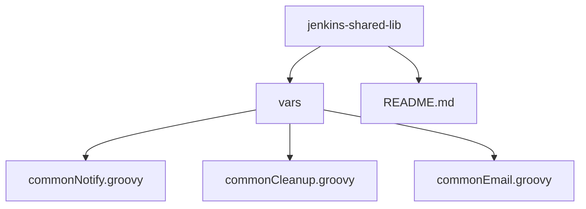
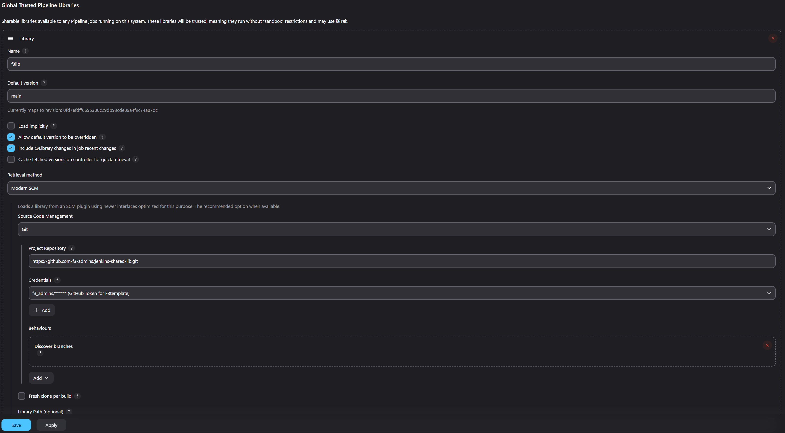

# F3Engineers Jenkins Shared Library

This repository contains a Jenkins Shared Library, which provides reusable Groovy scripts and functions to be shared across multiple Jenkins pipelines. The shared library helps streamline Jenkins pipeline development and promotes reusability and maintainability.

## Project Structure

The project structure is as follows:


### Key Directories and Files

- **`vars/`**:
  Contains custom Groovy scripts, which define reusable pipeline steps.

    - `commonNotify.groovy`: Script for managing notifications in pipelines.
    - `commonCleanup.groovy`: Script for handling cleanup tasks in pipelines.
    - `commonEmail.groovy`: Script for handling send notifications email in pipelines.

## Usage in Jenkins Pipeline

To use the shared library in your Jenkins pipelines, you'll need to include it as a global shared library in Jenkins. Follow the steps below to set it up:

1. Open Jenkins and navigate to **Manage Jenkins > Configure System**.
2. Scroll down to the **Global Pipeline Libraries** section.
3. Add a new library configuration:
    - Name: `f3lib` (or any name of your choice).
    - Default version: Specify the branch or version to use (e.g., `main` or `master`).
    - Project Repository: Provide the URL to


## Usage

```grooy
@Library('f3lib') _

pipeline {
    agent any 
    stages { 
        stage('Notify') {
            steps { 
                script { 
                    commonNotify('Build Started')
                }
            }
        }
        stage('Cleanup') {
            steps {
                script { 
                    commonCleanup()
                }
            }
        }
    }
}
```

```grooy
@Library('f3lib') _

pipeline {
    agent any
    environment {
        PROJECT_NAME = 'ExampleProject'
    }
    post {
        success {
            script {
                commonEmail(
                    'success@abc.com',
                    "✅ SUCCESS: ${env.JOB_NAME} #${env.BUILD_NUMBER} Build Status"
                )
            }
        }
        failure {
            script {
                commonEmail(
                    'failure@abc.com',
                    "❌ FAILURE: ${env.JOB_NAME} #${env.BUILD_NUMBER} Build Status"
                )
            }
        }
    }
}
```

## Contributing

If you wish to contribute to this library, feel free to fork this repository and submit a pull request. Make sure to adhere to the following guidelines:

- Follow proper code formatting and maintain a consistent style.
- Write descriptive commit messages to explain your changes.
- Provide a description for any new scripts or functionality you add.

## License

This project is licensed under the [MIT License](https://opensource.org/licenses/MIT). You are free to use, modify, and distribute this project under the terms of the license.
